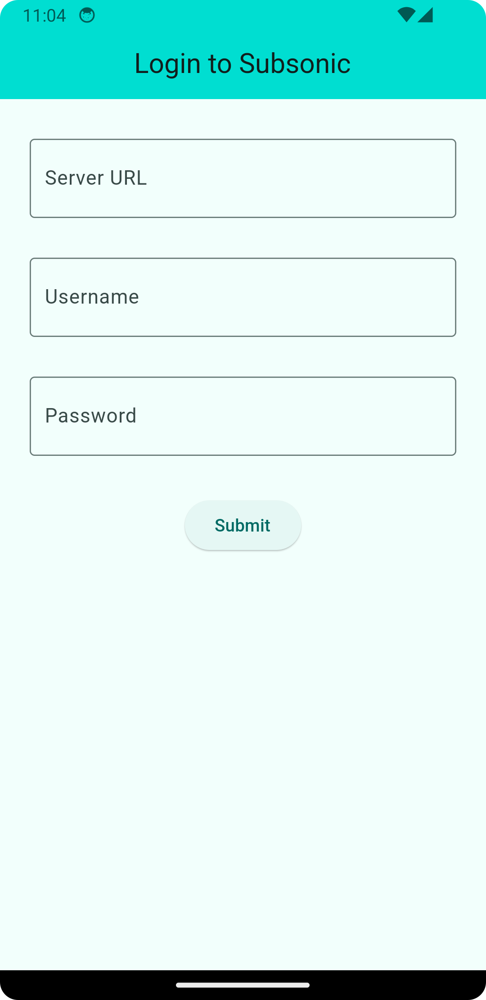
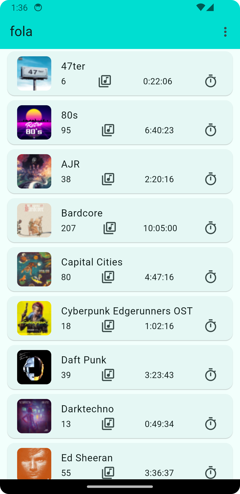
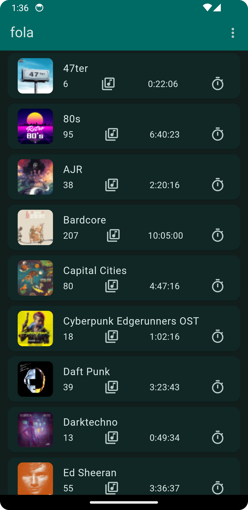
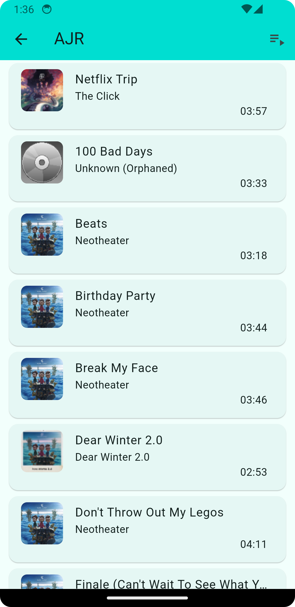
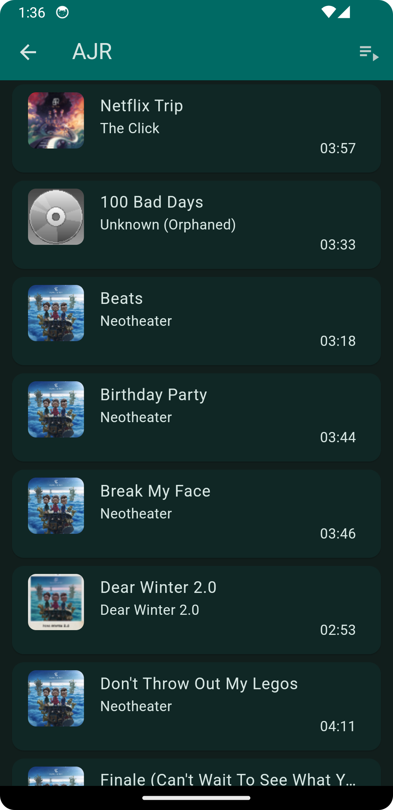

# FlSub

An [Ampache](https://ampache.org/) / [Subsonic](http://www.subsonic.org/pages/index.jsp) client for Android 12 (SDK API >= 18) in Flutter using Material 3.

## Features

This player is very primitive compared to fully fledged alternatives like [DSub](https://github.com/daneren2005/Subsonic), [Ultrasonic](https://gitlab.com/ultrasonic/ultrasonic) or [Audinaut](https://github.com/nvllsvm/Audinaut) to name a few.

FlSub is an app first made for my own needs: listening to playlists and smart playlists, looping songs or playlists, randomizing songs, integration with Android media notifications. A big goal was to be able to make the app easy to use and clutter free (and I think we can say this was achieved).

Bunch of cool (and technical) things:
- Material 3 support
- Dynamic color support (fallback to system theme if not available)
- Bookmarks generated when a playlist listening session is interrupted by a song or another playlist
- Caching playlists to disk to avoid useless API calls (songs are not cached though, only metadata)
- Subsonic authentication with salt+password for more security (salt changed for each request)

## Installing FlSub

You can either download an APK (generated by the CI when tagging) from the [releases](https://github.com/SuperFola/FlSub/releases), or use a tool like [Obtainium](https://github.com/ImranR98/Obtainium) to do it for you and get updates easily!

<a href="https://www.flaticon.com/free-icons/vinyl" title="vinyl icons">Vinyl icons created by Freepik - Flaticon</a>

## Screenshots

### Login to Subsonic

Tested with Ampache 5.6.2.
- **Important**: you need to generate an API key for your user and use that instead of your password

|                         Light mode                         |                        Dark mode                         |
|:----------------------------------------------------------:|:--------------------------------------------------------:|
|  |  |

### Playlists

|                              Light mode                               |                              Dark mode                              |
|:---------------------------------------------------------------------:|:-------------------------------------------------------------------:|
|     |     |
|  |  |
|       |       |

### Viewing a single playlist

|                              Light mode                               |                              Dark mode                              |
|:---------------------------------------------------------------------:|:-------------------------------------------------------------------:|
|  |  |
|            |       |
